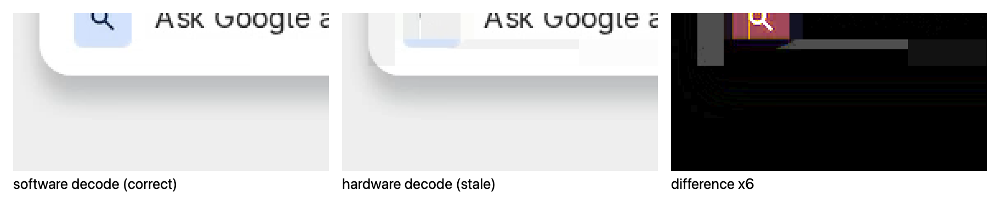

# WebCodecs hardware H.264 decode produces wrong pixels (stale macroblocks)

Self-contained browser repro for a Chromium defect: `VideoDecoder` with hardware
acceleration silently produces incorrect pixels on specific frames of a valid
H.264 stream. Small runs of macroblocks keep their previous contents instead of
being updated. No error is raised, `decode()` never throws, and every chunk
produces an `output()` frame.

**Live page: <https://webcodecs-hw-decode-repro.lewisl.workers.dev>** — open it in Chrome and it runs itself.



Frame index 56 of the fixture, decoded twice from identical bytes in Chromium 148 on macOS 26.5.1 (Apple silicon): software (left) draws the omnibox search icon, hardware (middle) leaves those macroblocks at their previous contents, and the 6x-amplified difference (right) is exactly the icon that was never applied.

The page decodes the same 240-frame stream twice, once with
`hardwareAcceleration: 'prefer-hardware'` and once with `'prefer-software'`,
and diffs the decoded pixels. The bytes are identical; only the decoder differs.

## Result on the machines tested so far

| variant (`drawImage` readback) | Chrome 150 / macOS (VideoToolbox) | Edge 150 / Windows (D3D11) |
|---|---|---|
| `prefer-hardware`, `optimizeForLatency: true`, recorded pacing | 18 | 35 |
| `prefer-hardware`, `optimizeForLatency: true`, full speed | 18 (same frames) | 35 |
| `prefer-hardware`, `optimizeForLatency: false` | 18 (same frames) | 35 |
| `no-preference` (resolves to hardware) | 18 (same frames) | 35 |
| `prefer-software` | 0 (baseline) | 0 (baseline) |

Every row: 240 outputs, 0 errors. Nothing fails — the pixels are just wrong.

Deterministic: on macOS, the same 18 frames every run (stream indices 56–65 and
183–192), independent of pacing and of `optimizeForLatency`.

Observed on (all macOS runs on one machine: macOS 26.5.1 build 25F80, Apple
silicon, VideoToolbox path; identical divergent-frame sets in each):

- **Google Chrome 150.0.7871.129 (stable, current)** — 18/240 in every hardware
  variant, 0/240 software. Same frame set as Chrome 139 below.
- Google Chrome 139.0.7258.67 (stable) — 18/240 in every hardware variant, 0/240 software.
- Chromium 148.0.7778.271 (Electron 42.5.1 embedded browser) — same 18/240 vs 0/240.

Unchanged across eleven major Chrome versions (139 → 150), on the same machine,
down to the identical divergent frames.

**Windows 25H2 (26200.8655), Edge 150.0.4078.65 (Official build, 64-bit;
D3D11/DXVA path)** — this page reports **35/240** differing on every hardware
variant, 0/240 software, 240 outputs and 0 errors throughout. A different
hardware decoder fails on a different number of frames, in the same way. So the
defect is not specific to one hardware vendor or one OS decode backend.

**Other browsers driving the same hardware decoders are clean.** This is the
strongest signal here: it points at Chromium's hardware decode path rather than
at the platform decoder or at the stream.

- **Safari on macOS** — the same VideoToolbox decoder Chrome uses: **0/240**, a
  completely clean hardware-vs-software diff.
- **Firefox Nightly on Windows** — the same D3D11 decoder Edge uses: none of the
  hardware-decoded frames show the corruption pattern. (Firefox does show an
  unrelated difference in which its *software* decode appears to overexpose
  frames, which inflates its raw diff count; the stale-macroblock pattern is
  absent from its hardware output.)

## The result does not depend on how the pixels are read back

Reasonable first objection: `drawImage` + `getImageData` sends a
hardware-decoded frame (NV12, GPU) through a YUV→RGB conversion that a
software-decoded frame (I420, CPU) does not take, so a difference measured that
way could in principle live in the conversion rather than in the decode.

The page therefore reads pixels back three independent ways and compares each
hardware run only against a software run read back **the same** way, so a
readback artifact cancels instead of counting as a decoder defect:

| pixel readback | conversion involved | frames differing (Chrome 150, macOS) |
|---|---|---|
| `drawImage` + `getImageData` | canvas YUV→RGB | 18 |
| `VideoFrame.copyTo({format:'RGBA'})` | WebCodecs YUV→RGB | 18 |
| `VideoFrame.copyTo()`, native format, **luma plane only** | **none** | 18 |

All three flag **the identical frames** — indices 56–65 and 183–192. The third
row is the decisive one: it compares plane 0 of the frame's native format (NV12
from the hardware decoder, I420 from the software decoder), which is
full-resolution 8-bit luma in both. No RGB conversion exists anywhere in that
path, so the wrong pixels are in the decoded frame itself.

One normalization is applied in that third row and is worth stating explicitly:
on this platform the software decoder reports **full-range** luma while the
hardware decoder reports **limited (studio) range**, so identical content lands
~18 levels apart in raw plane bytes (≈238 vs ≈220). That is range *signalling*,
not a decode difference; uncorrected it makes all 240 frames trivially differ.
Limited-range luma is expanded to full range before comparison, after which
clean frames agree to within ~0.4 levels — far below the 8-level threshold,
while the defect shows ~35.

## Why the input is known-good

- ffmpeg (libavcodec software) decodes all 240 access units with zero errors and
  produces the expected pixels.
- Chrome's own `prefer-software` decode matches ffmpeg on all 240 frames.
- Safari's hardware decode diverges from its own software decode on 0 of 240
  frames, and Firefox's hardware decode shows none of the corruption pattern —
  so two independent hardware decoders handle this stream correctly when they
  are not driven by Chromium.
- The fixture is the byte-exact stream as received over the wire in the
  originating application; per-frame payload hashes were verified identical at
  the encoder, the relay, and the receiving browser.
- No `error()` callback fires; every chunk produces exactly one output.

Cross-check the fixture yourself:

```sh
ffmpeg -i public/fixtures/019f6c88-surface-1.bin -vsync 0 /tmp/ref/f%04d.png
```

## Stream properties

- H.264 Constrained Baseline (`avc1.42e01e`), 2780x1668, from x264 `ultrafast` +
  `tune=zerolatency`, CAVLC, `bframes=0`, `ref=1`, `sliced-threads` (4 slices per
  access unit), `repeat-headers=1`, `scenecut=0`, effectively infinite keyint
  (keyframes only on demand), Annex-B with an AUD per access unit, in-band
  SPS/PPS before each IDR.
- 240 access units, 6 IDRs (the stream starts with one). Chunks are fed as
  `key`/`delta` accordingly, in order, one chunk per access unit.
- Notable structural quirk, and the prime suspect: during near-static content
  the encoder emits tiny P-frames (59–424 bytes) whose three tail slices are
  ~11 bytes each — all-skip slices covering thousands of macroblocks via
  `mb_skip_run`.
- Re-encoding the decoded frames with x264 at the same slice structure does
  **not** reproduce the defect, which is why the byte-exact fixture is included
  rather than a generator script.

## What the failure looks like

The corrupted region is MB-aligned: in the reported runs, three 16x16
macroblocks that the bitstream updates (verified via ffmpeg and via software
decode) instead retain the previous frames' pixels. Because the following
frames are skip-coded there, the stale content persists on screen until an
unrelated repaint or the next IDR — in the originating application (a remote
desktop stream) this shows up as a rectangle of the browser UI frozen at old
content, which is how the defect was first noticed.

The page renders, for every differing frame: the software decode, the hardware
decode, and a 6x-amplified absolute difference.

## Layout

```
public/index.html                       the harness (no build step, no server code)
public/fixtures/019f6c88-surface-1.bin  the stream, Annex-B H.264, 875,778 bytes
public/fixtures/019f6c88-surface-1.idx  per-AU index (see below)
wrangler.jsonc                          Cloudflare Workers static-assets config
```

`.idx` columns, one line per access unit:
`index, capture frame id, stream epoch, is_keyframe, byte length, arrival timestamp (ns)`.
Byte offsets are the running sum of the lengths. `is_keyframe` drives the
`EncodedVideoChunk` type; the arrival timestamps let the page replay with the
recorded pacing (including the idle gaps the defect follows).

## Running it

Any static file server works — the page is plain HTML with no build step:

```sh
python3 -m http.server -d public 8080   # then open http://localhost:8080/
```

Deploy (Cloudflare Workers static assets):

```sh
npm install
npx wrangler login     # once, interactive
npm run deploy
```

## License

The harness code is MIT. The fixture is a capture of a throwaway browser session
showing only `example.com`, included solely to reproduce this defect.
